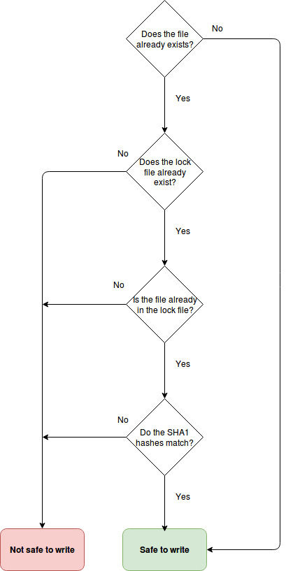

MeatUp lock file
==================

When you execute the MeatUp command for the first time it will create a `meatup.lock` file in the root direcory of your project. This file is used to determine, if it is save to (over-)write the generated files by the MeatUp command to the hard drive or not.

The lock file contains a [JSON](https://en.wikipedia.org/wiki/JSON) encoded array of the files which the MeatUp command has generated before. The relative file path from the root directory of your project is used as key and the [SHA1 hash](https://en.wikipedia.org/wiki/SHA-1) value of this file is used as value. When a new file is created the [SHA1 hash](https://en.wikipedia.org/wiki/SHA-1) of the existing file is compared to the value in the lock file. If they match, it means that the file that is about to be overwritten was generated by the MeatUp command and not modified since then. In that case it is considered safe to overwrite it, because the file can be fully recovered by reverting the changed in the entity file. If the file was modified, these changes would be lost after overwriting it and therefor is not considered safe.

The following diagram show the order and the result of the checks: 



Force overwrite
---------------

But what if you are absolutely sure that it is ok to overwrite an existing file despite the MeatUp command not considering it safe? In these cases you have to add the `--force` or `-f` option to to tell the MeatUp command to ignore all the checks metioned above. 

An example for this would be:

```shell
$ php app/console ip:meat-up --force "DevPro\adminBundle\Entity\Meatup"
```